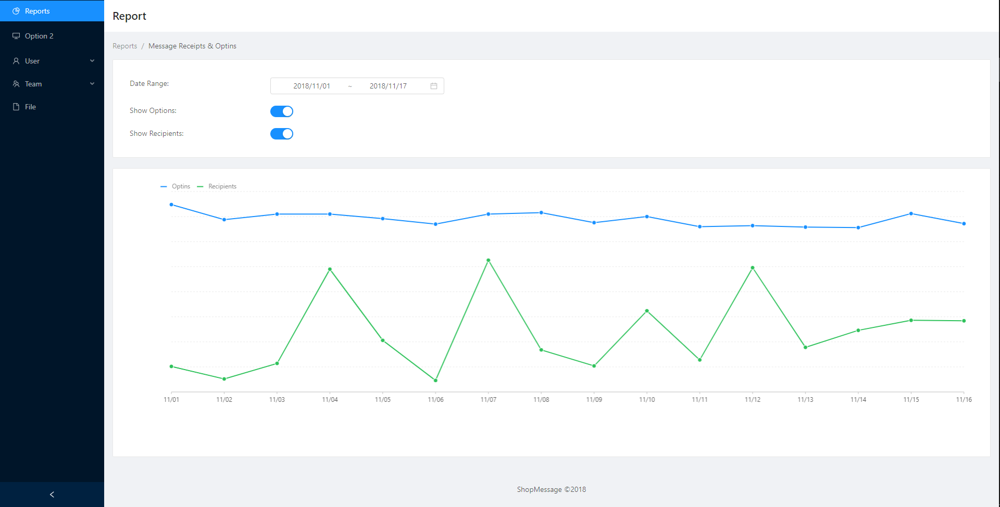
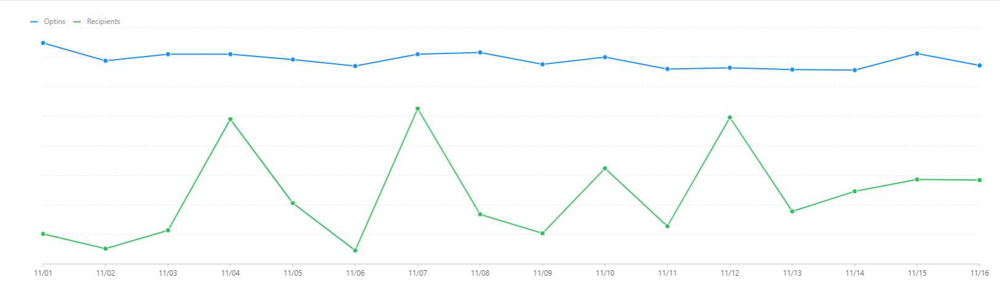

ShopMessage Assignment for React Developer
==========================================
Finished features in the given exercise:
- User can select a start and end date for which to show data.
- The "Optins" and "Recipeints" datasets are shown in the same chart. The X-axis represents calendar days.
- User can hide or reveal the "Optins" dataset from the chart.
- User can hide or reveal the "Recipients" dataset from the chart.


```

The chart I've made:
```


Instructions
------------
Clone this repository as a starting point
```
$> git clone https://github.com/jhetuts/shopmsg-chart-demo.git
```

Install the dependencies onto your local development environment.

```
$> npm install
```

To start the project run:
```
$> npm start
```


Deliverables
------------
**Code** - Clone this repository as a starting point: https://github.com/jhetuts/shopmsg-chart-demo.git

**Deployment** - Deployed at https://shop-msg-chart-demo.herokuapp.com/

**Screencast** - 
Notes
------------
- I added Report.tsx component for to seperate state actions.
- I've built Redux for state management when changing the date-range.
  - Under would be actions, reducers, and the store itself.
- Not really familiar with how **react-tsx** work so I've study only the basic to create an app out of it.
- Not able to solve the date-range mistake which is less than 1 (date) on the selected date-range.
- Not able to follow the said design based on the given screenshot of charts.
- I used **Bizcharts** as the chart.

Additional Features:
------------
- Legend is hoverable, thanks to the Bizcharts features.
- Legend can also be toggle
- Line are also hoverable for both Optins/Opt-ins and Recipients. You can also hover a line alone.
- Smooth transition of lines
- Since picking a date has a mistake, I limit the input to 3 and above so that system can avoid displaying odd chart.